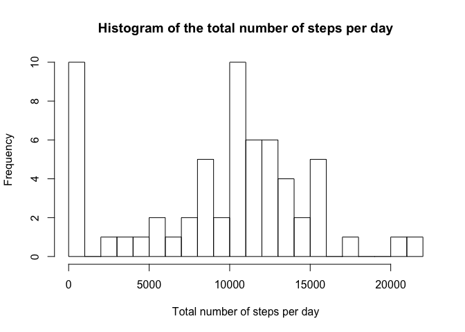

# Reproducible Research: Peer Assessment 1
Adrien ROUX  
Thursday, December 17, 2015  

## Loading and preprocessing the data

This assignment makes use of data from a personal activity monitoring device. This device collects data at 5 minute intervals through out the day. The data consists of two months of data from an anonymous individual collected during the months of October and November, 2012 and include the number of steps taken in 5 minute intervals each day.


```r
#we first unzip data and create a .csv file.
#we then load raw data from the newly created csv file.
unzip("activity.zip", exdir = ".")
rawData <- read.csv(file="activity.csv",header=T);

# take a first look at the raw data.
head(rawData);
```

```
##   steps       date interval
## 1    NA 2012-10-01        0
## 2    NA 2012-10-01        5
## 3    NA 2012-10-01       10
## 4    NA 2012-10-01       15
## 5    NA 2012-10-01       20
## 6    NA 2012-10-01       25
```

```r
str(rawData)
```

```
## 'data.frame':	17568 obs. of  3 variables:
##  $ steps   : int  NA NA NA NA NA NA NA NA NA NA ...
##  $ date    : Factor w/ 61 levels "2012-10-01","2012-10-02",..: 1 1 1 1 1 1 1 1 1 1 ...
##  $ interval: int  0 5 10 15 20 25 30 35 40 45 ...
```

The variables included in this dataset are:

* steps: Number of steps taking in a 5-minute interval (missing values are coded as NA)

* date: The date on which the measurement was taken in YYYY-MM-DD format

* interval: Identifier for the 5-minute interval in which measurement was taken

The dataset is stored in a comma-separated-value (CSV) file and a total of 17,568 observations are expected in this dataset. The actual data loaded contains 3.


```r
library("lubridate");
rawData$date <- ymd(rawData$date)

# summary overview
str(rawData)
```

```
## 'data.frame':	17568 obs. of  3 variables:
##  $ steps   : int  NA NA NA NA NA NA NA NA NA NA ...
##  $ date    : POSIXct, format: "2012-10-01" "2012-10-01" ...
##  $ interval: int  0 5 10 15 20 25 30 35 40 45 ...
```

```r
summary(rawData)
```

```
##      steps             date               interval     
##  Min.   :  0.00   Min.   :2012-10-01   Min.   :   0.0  
##  1st Qu.:  0.00   1st Qu.:2012-10-16   1st Qu.: 588.8  
##  Median :  0.00   Median :2012-10-31   Median :1177.5  
##  Mean   : 37.38   Mean   :2012-10-31   Mean   :1177.5  
##  3rd Qu.: 12.00   3rd Qu.:2012-11-15   3rd Qu.:1766.2  
##  Max.   :806.00   Max.   :2012-11-30   Max.   :2355.0  
##  NA's   :2304
```

## What is mean total number of steps taken per day?

For this part, we ignore the missing values in the dataset.


```r
totalNumberOfStepsPerDay <- with(rawData,tapply(steps,date,sum,na.rm=TRUE));

str(totalNumberOfStepsPerDay)
```

```
##  int [1:61(1d)] 0 126 11352 12116 13294 15420 11015 0 12811 9900 ...
##  - attr(*, "dimnames")=List of 1
##   ..$ : chr [1:61] "2012-10-01" "2012-10-02" "2012-10-03" "2012-10-04" ...
```

```r
summary(totalNumberOfStepsPerDay)
```

```
##    Min. 1st Qu.  Median    Mean 3rd Qu.    Max. 
##       0    6778   10400    9354   12810   21190
```

```r
hist(totalNumberOfStepsPerDay,breaks=30,
     xlab= "Total number of steps per day",
     main= "Histogram of the total number of steps per day")
```

 


```r
meanTotalNumberOfStepsPerDay <- mean(totalNumberOfStepsPerDay, na.rm = T);
medTotalNumberOfStepsPerDay <- median(totalNumberOfStepsPerDay, na.rm = T);
```

The **mean** total number of steps taken per day is 9354.2 steps, where as the **median** is 10395 steps.

## What is the average daily activity pattern?

Make a time series plot (i.e. type = "l") of the 5-minute interval (x-axis) and the average number of steps taken, averaged across all days (y-axis)


```r
library("ggplot2")
avgNumberOfStepsPerInterval <- aggregate(steps ~ interval, data=rawData, function(x){ return(mean(x,na.rm=T))});

g <- ggplot(avgNumberOfStepsPerInterval)
g <- g + geom_line(aes(x= interval, y=steps), alpha= 0.5, size= 0.5, color="black")
g <- g + xlab("5-minute Interval");
g <- g + ylab("Average number of steps taken");
g <- g + ggtitle("Average number of steps taken (missing values are still in dataset)");
g <- g + theme(plot.title = element_text(face="bold", colour="black", size=14, vjust = 1))
g <- g + theme(axis.title.x = element_text(face="bold", colour="black", size=10))
g <- g + theme(axis.title.y = element_text(face="bold", colour="black", size=10))
g <- g + scale_x_continuous(label=function(x){
    min = x %% 100;
    hour = (x - min)/100;
    return( sprintf("%02d:%02d", hour, min))})
g
```

 

Which 5-minute interval, on average across all the days in the dataset, contains the maximum number of steps?


```r
max5MinInterval <- avgNumberOfStepsPerInterval$interval[avgNumberOfStepsPerInterval$steps == max(avgNumberOfStepsPerInterval$steps)];
```

The 5-minute interval which contains the maximum number of steps on average across all the days is 835:02d.

## Imputing missing values

Note that there are a number of days/intervals where there are missing values (coded as NA). The presence of missing days may introduce bias into some calculations or summaries of the data.

* Calculate and report the total number of missing values in the dataset (i.e. the total number of rows with NAs)


```r
totalNumberOfMissingValues <- sum(is.na(rawData$steps));
proportionOfMissingValues <- totalNumberOfMissingValues / length(rawData$steps);
```

The total number of missing values in the dataset is 2304, which represents 13.1% of the whole sample.


* Devise a strategy for filling in all of the missing values in the dataset. The strategy does not need to be sophisticated. For example, you could use the mean/median for that day, or the mean for that 5-minute interval, etc.

To fill missing values in the dataset, we choose to replace NAs by the mean for the specific 5-min interval, which was previously computed above.

* Create a new dataset that is equal to the original dataset but with the missing data filled in.


```r
# copy original dataset to avoid loosing the original infos.
rawData1 <- rawData;
rawData1$steps[is.na(rawData1$steps)] = avgNumberOfStepsPerInterval$steps[as.character(rawData1$interval[is.na(rawData1$steps)])];

# check that everything went fine.
newTotalNumberOfMissingValues <- sum(is.na(rawData1$steps));
```


* Make an histogram of the total number of steps taken each day and Calculate and report the mean and median total number of steps taken per day. 


```r
newTotalNumberOfStepsPerDay <- with(rawData1,tapply(steps,date,sum,na.rm=TRUE));

hist(newTotalNumberOfStepsPerDay,breaks=30,
     xlab= "Total number of steps per day",
     main= "Histogram of the total number of steps per day\nOnce NA values have been removed.");
```

 

```r
newMeanTotalNumberOfStepsPerDay <- mean(newTotalNumberOfStepsPerDay, na.rm = F);
newMedTotalNumberOfStepsPerDay <- median(newTotalNumberOfStepsPerDay, na.rm = F);
```
The new **mean** total number of steps taken per day is 9354.2 steps which highly differs from the previous result, i.e. 9354.2 steps. Same observation can be done for median where the new **median** is 10395.0 steps where as the previous value was 10395.0 steps.

Do these values differ from the estimates from the first part of the assignment? What is the impact of imputing missing data on the estimates of the total daily number of steps?

The current estimates clearly differ from the one obtained in the first part of the assignement. Imputing missing data clearly increases the estimates of the total daily number of steps.


## Are there differences in activity patterns between weekdays and weekends?

For this part the weekdays() function may be of some help here. Use the dataset with the filled-in missing values for this part.

* Create a new factor variable in the dataset with two levels – “weekday” and “weekend” indicating whether a given date is a weekday or weekend day. 


```r
# we do not rely on weekdays function as it rely on the current language selected by the user.
# we instead use wday from the lubridate package which returns the day of the week as a decimal number (01-07, Sunday is 1)
rawData1$dayType <- factor(wday(rawData1$date) %in% 2:6,
                           levels = c(TRUE,FALSE),
                           labels = c("weekday","weekend"));
head(rawData1)
```

```
##   steps       date interval dayType
## 1    NA 2012-10-01        0 weekday
## 2    NA 2012-10-01        5 weekday
## 3    NA 2012-10-01       10 weekday
## 4    NA 2012-10-01       15 weekday
## 5    NA 2012-10-01       20 weekday
## 6    NA 2012-10-01       25 weekday
```

* Make a panel plot containing a time series plot (i.e. type = "l") of the 5-minute interval (x-axis) and the average number of steps taken, averaged across all weekday days or weekend days (y-axis). See the README file in the GitHub repository to see an example of what this plot should look like using simulated data.


```r
library("ggplot2")
activityAnalysis <- aggregate(steps ~ dayType + interval, data= rawData1, mean)

g <- ggplot(activityAnalysis);
g <- g + geom_line(aes(x= interval, y=steps), alpha= 0.5, size= 0.5, color="black")
g <- g + facet_grid(dayType ~ .)
g <- g + xlab("5-minute Interval");
g <- g + ylab("Average number of steps taken");
g <- g + ggtitle("Panel of the average number of steps taken\ndepending on the day type (WE/WD)");
g <- g + theme(plot.title = element_text(face="bold", colour="black", size=14, vjust = 1))
g <- g + theme(axis.title.x = element_text(face="bold", colour="black", size=10))
g <- g + theme(axis.title.y = element_text(face="bold", colour="black", size=10))
g <- g + scale_x_continuous(label=function(x){
    min = x %% 100;
    hour = (x - min)/100;
    return( sprintf("%02d:%02d", hour, min))})
g
```

 

As matter of fact, it does matter to split with respect to day type, i.e. weekend or weekday. For instance, wake up time occurs later in the morning on weekend.


## Appendix

We retrieve here the session info to allow here fellow users of this file to identify the OS, the R version and the package version we used to build this document.


```r
# retrieve session info with additional details on the version of the packages used to perform the current analysis.
sessionInfo()
```

```
## R version 3.2.1 (2015-06-18)
## Platform: x86_64-apple-darwin10.8.0 (64-bit)
## Running under: OS X 10.6.8 (Snow Leopard)
## 
## locale:
## [1] fr_FR.UTF-8/fr_FR.UTF-8/fr_FR.UTF-8/C/fr_FR.UTF-8/fr_FR.UTF-8
## 
## attached base packages:
## [1] stats     graphics  grDevices utils     datasets  methods   base     
## 
## other attached packages:
## [1] ggplot2_1.0.1   lubridate_1.3.3
## 
## loaded via a namespace (and not attached):
##  [1] Rcpp_0.12.1      digest_0.6.8     MASS_7.3-40      grid_3.2.1      
##  [5] plyr_1.8.3       gtable_0.1.2     formatR_1.2.1    magrittr_1.5    
##  [9] scales_0.3.0     evaluate_0.8     stringi_1.0-1    reshape2_1.4.1  
## [13] rmarkdown_0.8.1  labeling_0.3     proto_0.3-10     tools_3.2.1     
## [17] stringr_1.0.0    munsell_0.4.2    yaml_2.1.13      colorspace_1.2-6
## [21] memoise_0.2.1    htmltools_0.2.6  knitr_1.11
```
